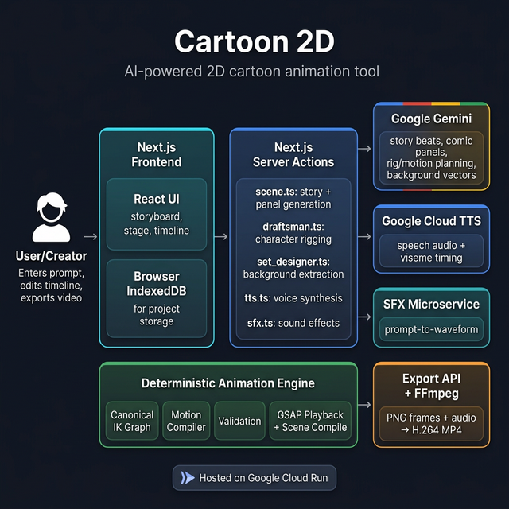

# 🎬 Cartoon 2D

**AI-powered 2D cartoon creation tool** — describe a story, get animated scenes with rigged characters, backgrounds, dialogue, sound effects, and exportable MP4 video.

> Built for the [Gemini Live Agent Challenge](https://geminiliveagentchallenge.devpost.com/) — Creative Storyteller category.



## ✨ Features

- **Prompt-to-Animation** — Describe a story in natural language. Gemini generates structured scene beats, comic panel images, character rigs, motion clips, dialogue, and sound effects.
- **SVG Character Rigging** — AI-generated characters with full bone hierarchies, IK constraints, rotation limits, and multiple animation views (front/side/back).
- **Deterministic Animation Engine** — AI returns motion *intent*; a TypeScript runtime compiles it into validated, reusable animation clips with GSAP-powered playback.
- **Timeline Editor** — Multi-track timeline with draggable action pills, voice tracks, SFX tracks, keyframe editing, and real-time preview.
- **Lip Sync** — Google Cloud TTS with viseme timing drives SVG mouth shapes or jaw bone rotation for speech animation.
- **Sound Effects** — AI-generated sound effects placed on the timeline.
- **Camera System** — Pan, zoom, rotate with start/end keyframe interpolation and actor tracking.
- **MP4 Export** — Frame-by-frame capture with server-side FFmpeg muxing into download-ready H.264 video.
- **Project Persistence** — Auto-save to browser IndexedDB with project management.

## 🛠️ Tech Stack

| Layer | Technology |
|-------|-----------|
| Frontend | Next.js 16, React 19, TypeScript, Tailwind CSS 4 |
| Animation | GSAP, custom IK solver, SVG manipulation |
| AI Generation | **Gemini 3.1 Flash Image Preview** (scenes, panels), **Gemini 3.1 Pro Preview** (rigging, motion) via `@google/genai` SDK |
| Voice | **Google Cloud Text-to-Speech** with viseme timing |
| Sound Effects | Stable Audio via external microservice |
| Export | FFmpeg (server-side H.264 muxing) |
| Hosting | **Google Cloud Run** |
| Storage | Browser IndexedDB (local) |

## 🚀 Quick Start (Local Development)

### Prerequisites
- Node.js 22+
- A [Gemini API key](https://aistudio.google.com/apikey)

### Setup

```bash
# Clone the repo
git clone https://github.com/ksvslk/cartoon2d.git
cd cartoon2d

# Install dependencies
npm install --legacy-peer-deps

# Set your API key
echo "GEMINI_API_KEY=your-key-here" > .env.local

# Start dev server
npm run dev
```

Open [http://localhost:3000](http://localhost:3000).

### Usage
1. Type a story prompt (e.g., "A fox meets a rabbit in a forest")
2. Click **Generate** — Gemini creates scene beats with inline comic panels
3. Click a scene → rigs are generated for each character
4. Preview animation on the Stage, edit timing in the Timeline
5. Export to MP4

## ☁️ Google Cloud Deployment

The app is deployed on **Google Cloud Run**:

**Live URL:** https://cartoon2d-243022700959.us-central1.run.app

### Deploy from source

```bash
gcloud run deploy cartoon2d \
  --source . \
  --region us-central1 \
  --allow-unauthenticated \
  --set-env-vars "GEMINI_API_KEY=your-key" \
  --memory 1Gi \
  --port 3000 \
  --project your-project-id
```

### Google Cloud Services Used
- **Cloud Run** — Hosts the Next.js application (frontend + backend server actions)
- **Cloud Text-to-Speech** — Generates dialogue audio with phoneme timing for lip sync
- **Generative Language API** — Gemini models for multimodal content generation

## 🏗️ Architecture

```
User → Next.js React App → Next.js Server Actions → Gemini API
                                                   → Cloud TTS
                                                   → SFX Service
         ↓                        ↓
   Browser IndexedDB    Deterministic Animation Engine
   (project storage)    (IK graph, motion compiler,
                         validation, GSAP playback)
                                   ↓
                           /api/export + FFmpeg → MP4
```

Key design principle: **AI produces intent, deterministic code produces animation.** The Gemini model returns structured motion specifications; the TypeScript runtime compiles, validates, and plays them using a canonical IK graph — no anatomy-specific heuristics.

## 📄 License

MIT
